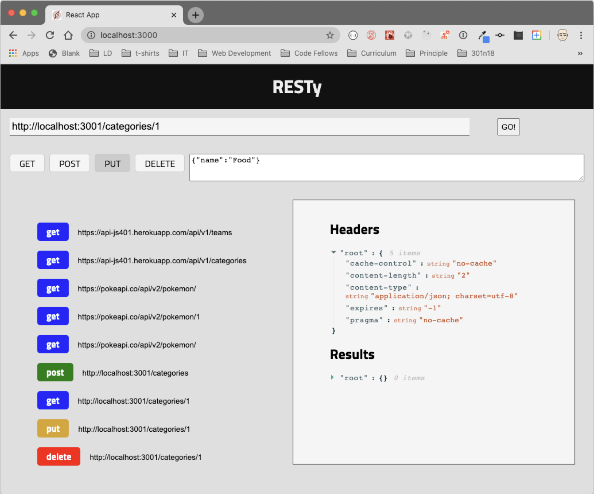
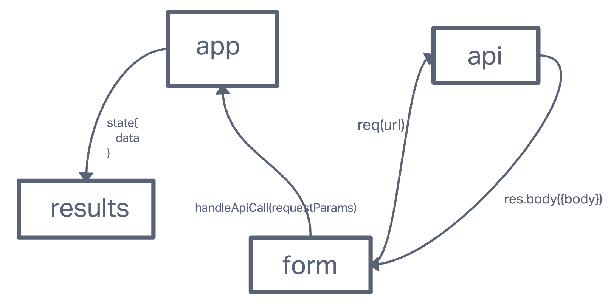

# Resty

## Description

A browser based API tool

## Business Requirements

API testing tool that com eb ren in any browser, allowing a user to easily interact with APIs in a familiar interface

The core requirements and functionality are as follows:

- Simple, intuitive user interface

  - A form where a user:

    - Enters a REST API Endpoint (URI)
    - Selects the REST Method to use (get, post, put, delete)
    - For put and post, allow the user to enter JSON to be used as the body for the request
    - A button to initiate the request

  - An output section which:
    - Displays a spinner to indicate a request is in process
    - Once a request is complete:
      - Hide the spinner
      - Display a well formatted view of the API response in 2 sections
        - Headers
        - Body
  - A history section which:
    - Shows a list of all unique, successful requests
    - Allows a user to click or select one to re-populate the form so they can repeat the request

## Technical Requirements

1. React
2. ES6 Classes
3. Shared Component State
4. Local Storage for storing request history
5. Superagent or Axios for performing API Requests
6. SASS for styling
   - Global Theme
   - Component specific CSS where possible
7. Test Driven Development, using Jest
   - Tests will be runnable locally
8. Deployment to GitHub Pages using an Action

## UML

